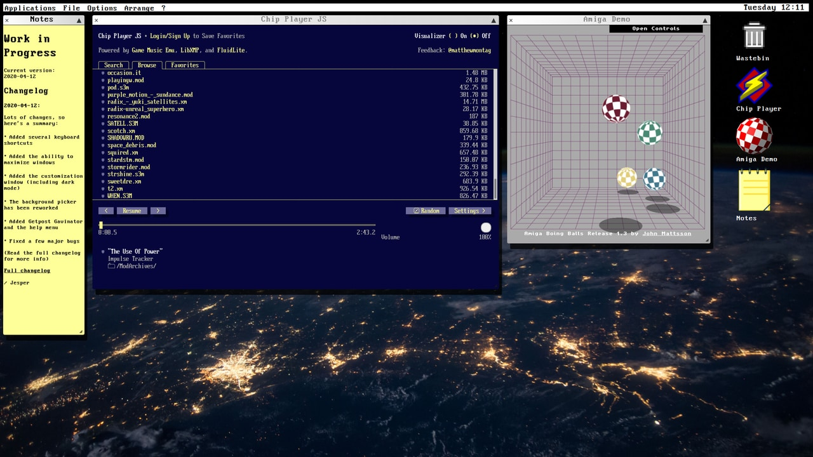

# Retro Desktop Environment

Retro Desktop Environment is a project which aims to provide a somewhat similar, yet distinct, experience to older computer operating systems.

It doesn't need to be downloaded and runs in any modern web browser.

Try it out: [Retro Desktop Environment](https://vecopotryx.github.io/retro-desktop-environment/).

