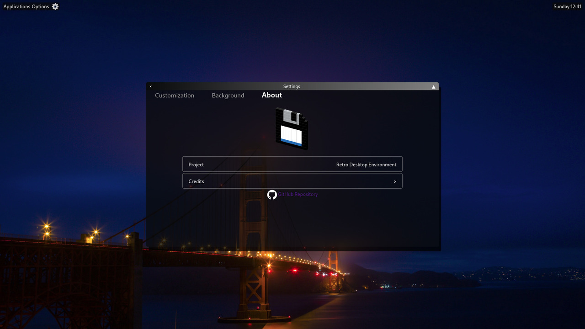

# Tranquility Desktop

Tranquility Desktop (Formerly known as Retro Desktop Environment) is a project which aims to provide a somewhat similar, yet distinct, experience to computer operating systems.

It was previously using jQuery but has now been rewritten with React and TypeScript.

It doesn't need to be downloaded and runs in any modern web browser.

Try it out: [Tranquility Desktop](https://vecopotryx.github.io/tranquility-desktop/).
